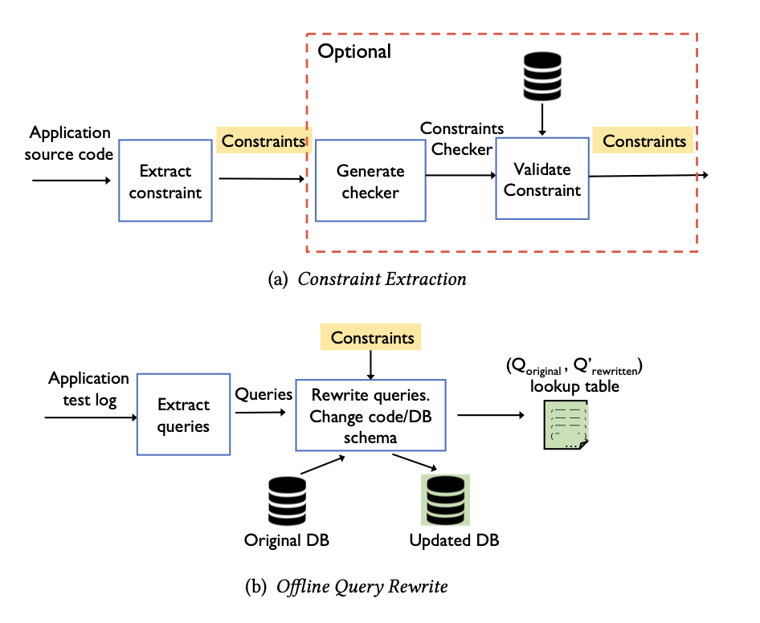

# `ConstrOpt` Overview
This is the official repository for [Leveraging Applicaton Data Constraints to Optimize Database-Backed Web Applications](https://arxiv.org/abs/2205.02954) by Xiaoxuan Liu, Shuxian Wang, Mengzhu Sun, Sharon Lee, Sicheng Pan, Joshua Wu, Cong Yan, Junwen Yang, and Alvin Chueng. 
Here we present `ConstrOpt`, the first tool that identifies data relationships by analyzing the programs that generate and maintain the persist data. Once identified,`ConstrOpt` leverages the found constraints to optimize the application's physical design and query execution by rewriting queries. Instead of developing a fixed set of predefined rewriting rules, `ConstrOpt` employs an enumerate-test-verify technique to automatically exploit the discovered data constraints to improve query execution. 


## Install
### Ruby Dependencies
We highly recommend use [rbenv](https://github.com/rbenv/rbenv#command-reference) or [rmv](https://rvm.io) to manage ruby environments. Note that `ConstrOpt` requires ruby version >= 3.0.0.  
To install third party libraries for ruby, under root directory, run
``` 
bundler install
```
### Python Dependencies
We highly recommend install and manage python dependencies using `conda`. Run command `conda create --name <your_env_name> --file requirements.txt` for installing dependencies. 

## Experiment
All experiments we did in the paper are under `/constropt/autrite` directory. For re-run experiements on redmine, openprojects, and forem, run the following under the `/constropt/autrite` directory. `/constropt/autrite/` directory contains util functions for experiment evaluation. 
```
python3 pipeline.py --app <appname>
python3 pipeline.py --app redmine  # example
```
The following is the version information we use for apps in our experiments.
| Application | Ruby Version | Release Version/Tag                             |
|-------------|--------------|-------------------------------------------------|
| ConstrOpt   | >= 3.0.0     | NA                                              |
| Redmine     | 3.0.0        | commit cfba76019b31e22e2de4b1a8b99b201fc31ada29 |
| Dev.to      | 2.7.2        | commit cfba76019b31e22e2de4b1a8b99b201fc31ada29 |
| Openproject | 2.7.4        | commit cfba76019b31e22e2de4b1a8b99b201fc31ada29 |
| mastodon    | 3.0.2        | tag 3.5.5, commit fbcbf7898f000d9d1a21d52e8a8d3ed4602aa7db |
| spree       | 3.0.0        | tag 4.4.0, commit 5c9dffb84028085d044e199e6f6f8a20c02dca11 |
| openstreetmap| 3.0.0       | commit 5c76c5a933d212c48e6e1b83361f62e7f1b6c3cc

## Constraint Extractor
Constraint extractor extracts both application constraints and database constraints automatically from the source code. Constraint extractor is under `/constropt/constr_extractor/` directory.
ConstrOpt to extract constraints of different types as shown below.
- **Inclusion**: the field value is restricted to a limited set.
- **Presence**: the field value cannot be null. This is the same as the SQL NOT NULL constraint, but is only implicitly defined in the
application code.
- **Length**: the length of a string field should be in a certain range.
- Uniqueness: same as the SQL uniqueness constraint, but is only
defined in the application.
- **Format**: the value of a string field must match a regular expres-
sion, which is specified in the application code.
- **Numerical**: the value of a numerical field must lie in the range
specified in the application code.
- **Foreign key**: same as the SQL foreign key constraint, where the
field points to the primary key of the referenced table.
### Run Extractor
Under the root directory (`\ConstrOpt`), run 
```
ruby extract.rb <appname>
ruby extract.rb redmine    # example 
```
### Run tests
Under the root directory (`\ConstrOpt`), following the following command:
```
cd constropt/constr_extractor/      # enter directory
bundle install                      # install ruby dependencies
./run_test.sh                       # run all tests 
```

## Query Rewriter
ConstrOpt employs an enumerate-test-verify technique to automatically exploit the discovered data constraints to improve query execution. Each resulting rewrite is provably equivalent semantically to the original query. 
### How to run Rewriter tests
Under `constropt/` directory, run
```
python3 query_rewriter_tests/test.py # run all tests
```
